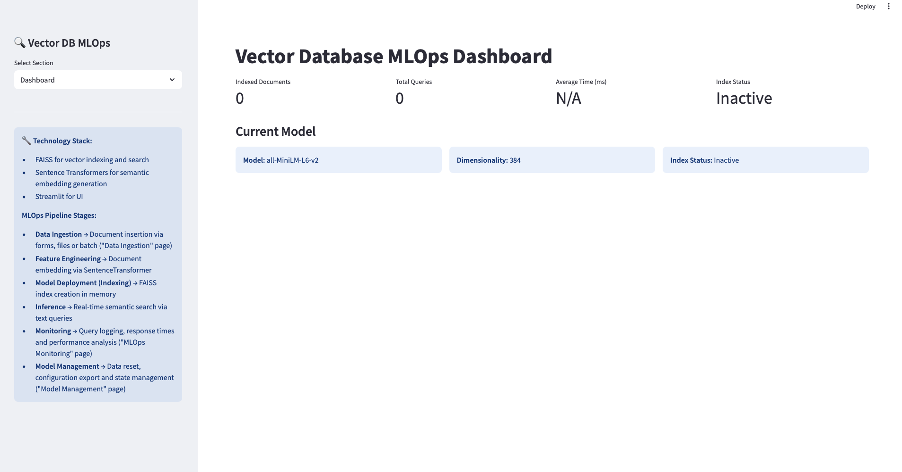

# Vector DB MLOps Pipeline

An interactive Streamlit app that integrates a vector database (FAISS) into an MLOps pipeline for semantic search on textual data. This project demonstrates how modern vector-based techniques can be used within real-world retrieval workflows, complete with monitoring, inference, and model management.

## Features

- Manual or file-based document ingestion
- Semantic embedding generation (Sentence Transformers)
- FAISS index creation and vector-based similarity search
- Interactive semantic query interface
- Real-time query monitoring and performance metrics
- Model state export and management interface

## MLOps Pipeline Overview

| MLOps Phase         | Implementation in Code                           |
| ------------------- | ------------------------------------------------ |
| Data Ingestion      | Upload via text form or `.txt` file              |
| Feature Engineering | Embedding generation via `SentenceTransformer`   |
| Model Deployment    | FAISS indexing with `IndexFlatIP`                |
| Inference           | Real-time semantic search                        |
| Monitoring          | Query logs, response times, result count, hashes |
| Model Management    | Reset, export, and control pipeline state        |

## Quickstart

1. Clone the repository:

```bash
git clone https://github.com/your-username/vector-db-mlops.git
cd vector-db-mlops
```

2. Install the dependencies:

```bash
pip install -r requirements.txt
```

3. Run the application:

```bash
streamlit run main.py
```

## Core Dependencies

- Python ≥ 3.9
- faiss-cpu
- sentence-transformers
- streamlit
- plotly
- pandas, numpy

## Screenshots

  
Dashboard view with key metrics and model status

This project is part of a broader study exploring how vector databases can be effectively integrated into MLOps pipelines.
